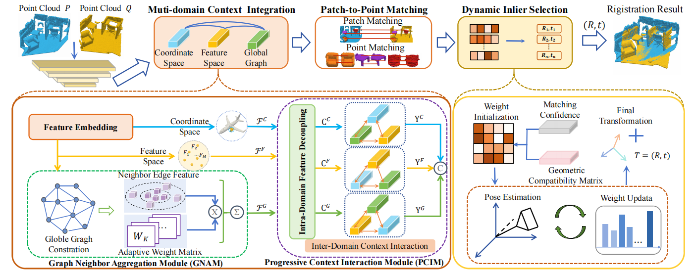
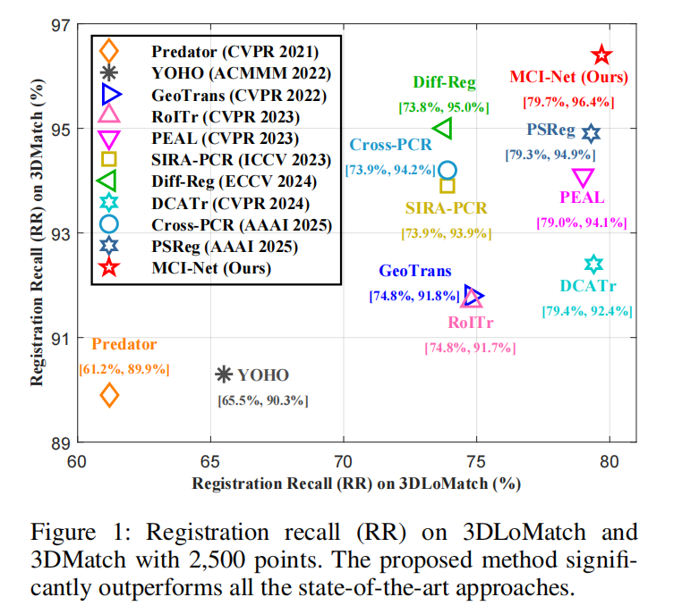

# MCI-Net

This repository provides the official PyTorch implementation of MCI-Net.
If you find this project useful, please cite our work. Your support is greatly appreciated.


<h2 align="center">
<a  target="_blank">MCI-Net: A Robust Multi-Domain Context Integration Network for Point Cloud Registration</a>
</h2>

## Introduction

<div align="center">
    
</div>

The experimental results of MCI-Net
<div align="center">
    
</div>


## Installation

Please use the following command for installation.

```bash
# It is recommended to create a new environment
conda create -n pareconv python==3.7.7
conda activate MCI-Net


pip install torch==1.13.0+cu116 torchvision==0.14.0+cu116 torchaudio==0.13.0 --extra-index-url https://download.pytorch.org/whl/cu116

# Install packages and other dependencies
pip install -r requirements.txt
python setup.py build develop

cd pareconv/extentions/pointops/
python setup.py install
```

Code has been tested with Ubuntu 18.04, GCC 7.5.0, Python 3.9, PyTorch 1.13.0, CUDA 11.6 and cuDNN 8.0.5.

## Dataset

##### 3DMatch should be organized as follows:
```text
--your_3DMatch_path--3DMatch
              |--train--7-scenes-chess--cloud_bin_0.pth
                    |--     |--...         |--...
              |--test--7-scenes-redkitchen--cloud_bin_0.pth
                    |--     |--...         |--...
              |--train_pair_overlap_masks--7-scenes-chess--masks_1_0.npz
                    |--     |--...         |--...       
```

Modify the dataset path in `experiments/3DMatch/config.py` to
```python
_C.data.dataset_root = '/your_3DMatch_path/3DMatch'
```

##### KITTI should be organized as follows:
```text
--your_KITTI_path--KITTI
            |--downsampled--00--000000.npy
                    |--...   |--... |--...
            |--train_pair_overlap_masks--0--masks_11_0.npz
                    |--...   |--... |--...
```                   

Modify the dataset path in `experiments/KITTI/config.py` to
```python
_C.data.dataset_root = '/your_KITTI_path/KITTI' 
```

## Training
You can train a model on 3DMatch (or KITTI) by the following commands:

```bash
cd experiments/3DMatch (or KITTI)
CUDA_VISIBLE_DEVICES=0 python trainval.py
```
You can also use multiple GPUs by:
```bash
CUDA_VISIBLE_DEVICES=GPUS python -m torch.distributed.launch --nproc_per_node=NGPUS trainval.py
```
For example,
```bash
CUDA_VISIBLE_DEVICES=0,1 python -m torch.distributed.launch --nproc_per_node=2 trainval.py
```

## Testing
To test a pre-trained models on 3DMatch, use the following commands:
```bash
# 3DMatch
python test.py --benchmark 3DMatch --snapshot ../../pretrain/3dmatch.pth.tar
python eval.py --benchmark 3DMatch
```
To test the model on 3DLoMatch, just change the argument `--benchmark 3DLoMatch`.

To test a pre-trained models on KITTI, use the similar commands:
```bash
# KITTI
python test.py --snapshot ../../pretrain/kitti.pth.tar
python eval.py
```


## Citation
```shell
@inproceedings{lin2026mcinet,
  title = {MCI-Net: A robust multi-domain context integration network for point cloud registration},
  author = {Lin, Shuyuan and Chen, Xiao and Xiao, Guobao and Wang, Hanzi and Huang, Feiran and Weng, Jian},
  journal = {Proceedings of the AAAI Conference on Artificial Intelligence},
  year = 2026,
  volume = {40},
  pages = {23585--23593},
}
```


## Acknowledgements
The code is brought from
- [GeoTransformer](https://github.com/qinzheng93/GeoTransformer)
- [VectorNeurons](https://github.com/FlyingGiraffe/vnn)
- [PAConv](https://github.com/CVMI-Lab/PAConv)
